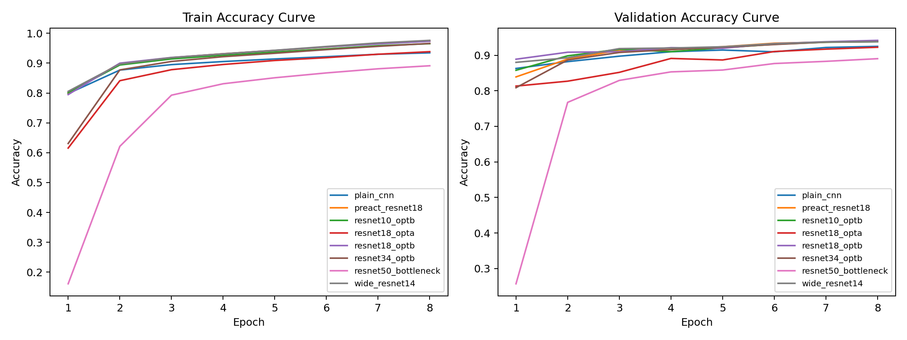
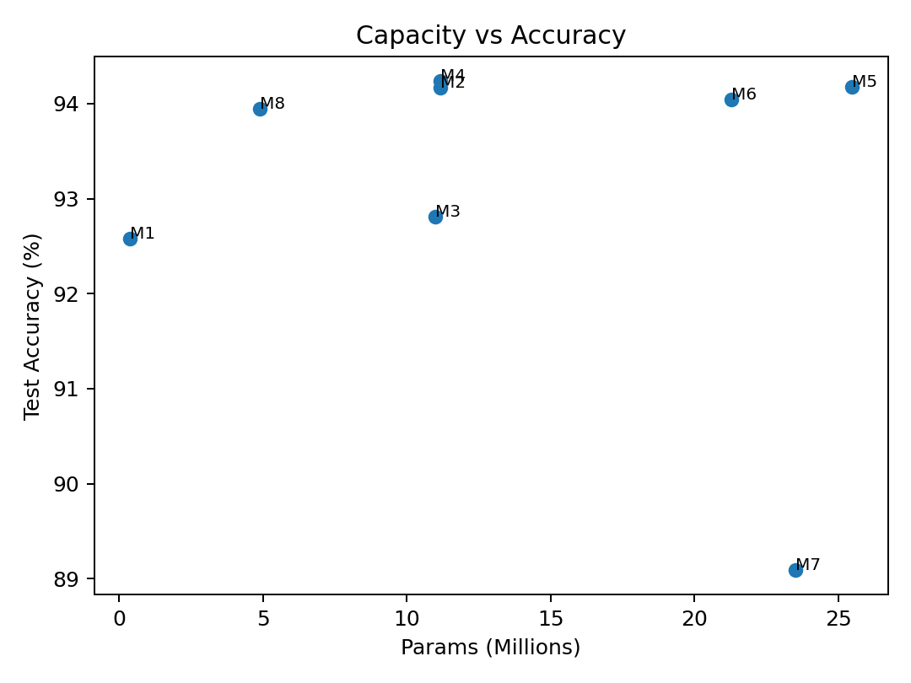

# Reproducing ResNet on FashionMNIST-Resplit

## Objective
This project reproduces key ideas of ResNet and evaluates architectural variants on FashionMNIST-Resplit.  
The study compares baseline CNN, residual design choices, pre-activation, width scaling, depth scaling, and bottleneck design under a controlled protocol.

## (a) Implementation

### Architecture and model family
I implemented a unified model factory in `models/resnet_variants.py` with the following variants:

- **M1** Plain-CNN (no residual connection)
- **M8** ResNet-10-OptB
- **M2** ResNet-18-OptB
- **M3** ResNet-18-OptA
- **M4** PreAct-ResNet-18
- **M5** Wide-ResNet-14
- **M6** ResNet-34-OptB
- **M7** ResNet-50-Bottleneck

All residual variants use a 4-stage backbone (`layer1`-`layer4`) with stage transitions that reduce spatial size and increase channels.

### Alignment with the original ResNet paper
- **VGG-style small filters:** the backbone primarily uses `3x3` convolutions, following the small-kernel design philosophy used in ResNet.
- **Stage-wise scaling rule:** when feature map resolution is reduced, channel width is increased (64/128/256/512 stages), consistent with standard ResNet scaling practice.
- **Global average pooling head:** `nn.AdaptiveAvgPool2d((1, 1))` is used before the classifier, avoiding large early fully connected layers and matching the ResNet classifier design pattern.
- **Residual learning core:** each residual block learns a residual function and adds it to an identity/shortcut path.
- **Shortcut mismatch handling (paper-style options):**
  - **Option A (zero-padding):** implemented by `ShortcutA`, introducing no additional learnable parameters for channel expansion.
  - **Option B (projection):** implemented via `1x1` convolution projection in the shortcut path.

### Pragmatic deviations for FashionMNIST (and rationale)
- **Stem adaptation for low resolution:** unlike the ImageNet-style aggressive stem (`7x7` stride-2 + maxpool), this project uses a `3x3` stride-1 stem to avoid early information loss on `28x28` inputs.
- **Input channel adaptation:** `in_channels=1` is used because FashionMNIST is grayscale (not 3-channel RGB).
- **Family extensions beyond the original 2015 paper:** `PreAct-ResNet-18` and `Wide-ResNet-14` are included to compare later ResNet-family improvements in optimization and representation.
- **Additional depth/efficiency probes:** `ResNet-10`, `ResNet-34`, and `ResNet-50-Bottleneck` are added as controlled depth/capacity comparisons under the same training protocol.

### Engineering choices for reproducibility
- Dataset: FashionMNIST-Resplit (`28x28`, grayscale), which is smaller than ImageNet and requires different practical design choices.
- Data pipeline acceleration: offline tensor cache (`results/cache/fashion_tensor_cache.pt`) is built from parquet image bytes to remove repeated PNG decoding during training.
- Fixed-budget protocol: optimizer, scheduler, epochs, and regularization are held constant across models for fair controlled comparison.

## (b) Experimental results

### Unified training protocol
- Optimizer: SGD with Nesterov momentum
- Initial LR: 0.05
- Scheduler: CosineAnnealingLR
- Weight decay: 5e-4
- Batch size: 256
- Epochs: 8
- Augmentation: enabled

Main suite (M1-M5) uses 3 seeds (`42`, `3407`, `2025`).  
Supplement/depth runs (M6/M7/M8) currently use seed `42` for directional comparison.

### Quantitative summary
From `results/summary_matrix.csv`:

| Model | Params (M) | Test Acc Mean (%) | Relative Gain vs M1 (pp) |
|---|---:|---:|---:|
| M1 Plain-CNN | 0.391 | 92.583 | 0.000 |
| M8 ResNet-10-OptB | 4.902 | 93.950 | +1.367 |
| M2 ResNet-18-OptB | 11.173 | 94.170 | +1.587 |
| M3 ResNet-18-OptA | 10.999 | 92.810 | +0.227 |
| M4 PreAct-ResNet-18 | 11.170 | **94.237** | **+1.653** |
| M5 Wide-ResNet-14 | 25.487 | 94.180 | +1.597 |
| M6 ResNet-34-OptB | 21.281 | 94.040 | +1.457 |
| M7 ResNet-50-Bottleneck | 23.520 | 89.090 | -3.493 |

Supporting files:
- Run-level matrix: `results/run_matrix_final.csv`
- Model-level summary: `results/summary_matrix.csv`
- Model definitions: `results/model_definition_matrix.csv`

### Figures
Figure 1 and Figure 2 are generated from the canonical final matrix:

## (c) Discussion and conclusions

### Residual connection effectiveness
M2 (ResNet-18-OptB) outperforms M1 (Plain-CNN) by **+1.587 pp**, confirming residual learning is beneficial on this dataset.

### Shortcut ablation (Option A vs Option B)
M2 vs M3 shows **+1.360 pp** in favor of Option B, indicating projection shortcuts are substantially stronger than zero-padding under this setup.

### Pre-activation effect
M4 is the best-performing model among the tested set, with a small but consistent gain over M2 (**+0.067 pp**), supporting improved optimization behavior with pre-activation design.

### Width/depth trade-off under fixed budget
- M5 (Wide-ResNet-14) is near M2 in accuracy but with much larger parameter cost.
- M6 (ResNet-34-OptB) does not surpass M2 under the fixed protocol.
- M8 (ResNet-10-OptB) is slightly below M2 but offers a lighter model.

These results suggest diminishing returns for simply increasing depth/width on low-resolution FashionMNIST under a fixed training budget.

### Bottleneck result and scope
M7 (ResNet-50-Bottleneck) underperforms significantly in the current budgeted setting.  
This should be interpreted as **budget-constrained evidence** rather than a universal statement that bottleneck/deeper models are inferior. Deeper models may need longer training and dedicated hyperparameter tuning to realize their representational advantage.

## (d) Additional notes

- **Negative result is informative:** M7 highlights that architecture scaling without retuning can fail even with higher capacity.
- **Runtime constraint evidence:** Deep variants had much higher training time, which directly affected exploration breadth.
- **Single-seed supplements:** M6/M7/M8 are currently directional findings (seed=42), while M1-M5 are supported by multi-seed statistics.
- **Data pipeline troubleshooting:** Caching tensors from parquet bytes removed repeated PNG decode overhead and stabilized data throughput.

## Limitations and next steps
- Supplement/depth models are not yet multi-seed; future work can add seeds for stronger statistical confidence.
- A tuned deep-model protocol (warm-up, longer epochs, model-specific LR schedule) can further test whether deeper models eventually outperform shallower ones.

