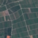
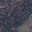
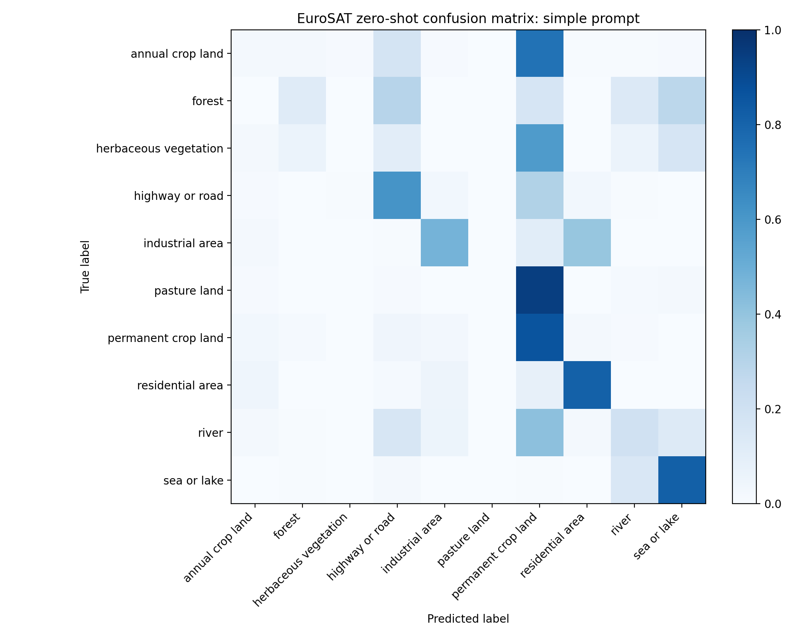
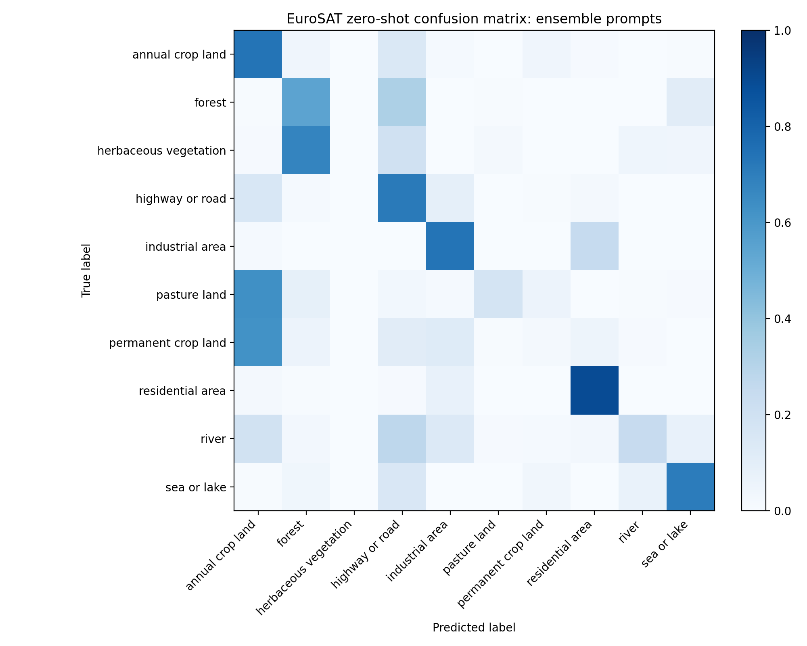
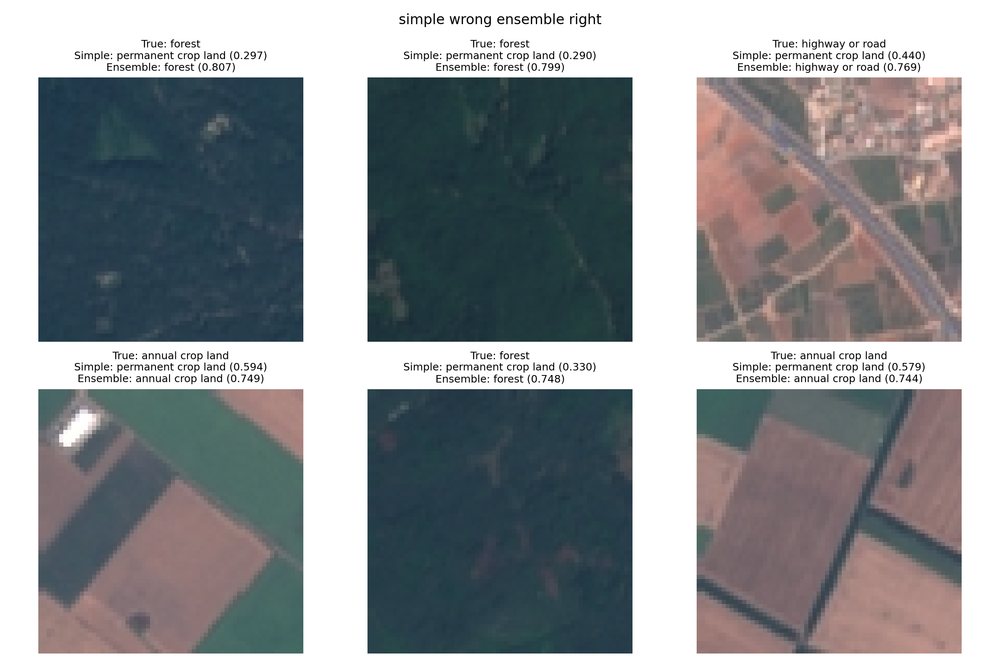
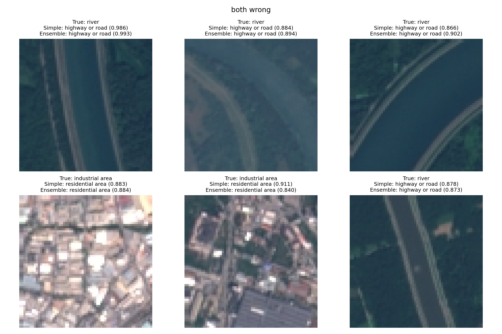
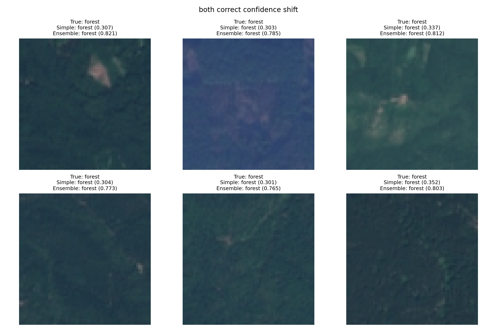
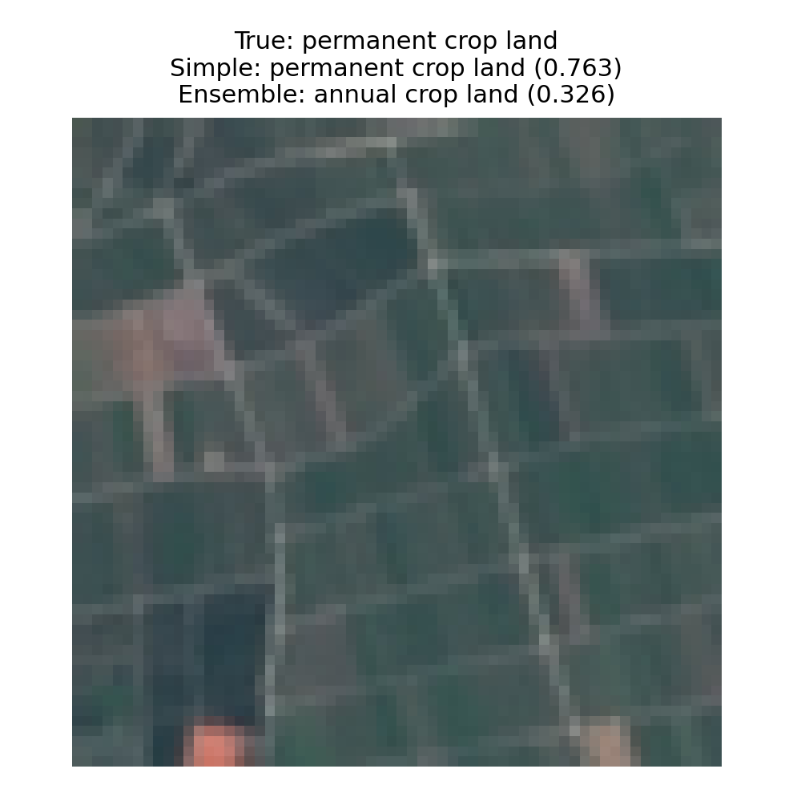

# EuroSAT Zero-Shot Classification with CLIP

## 1. Introduction

This report studies zero-shot image classification on the EuroSAT dataset using the OpenAI CLIP model `ViT-B/32`. The goal is to evaluate whether prompt ensembling improves zero-shot transfer on remote-sensing imagery relative to a simple generic prompt.

Two prompt settings are compared. The baseline uses the assignment-specified template `a photo of a {CLASS}.` The second setting uses the documentation-provided EuroSAT prompt ensemble:

- `a centered satellite photo of {}.`
- `a centered satellite photo of a {}.`
- `a centered satellite photo of the {}.`

The central question is whether this documentation-provided ensemble improves overall accuracy, how stable the gain is, and which classes benefit or suffer most from the change in prompt design.

## 2. Experimental Setup

The experiment uses the EuroSAT dataset, which contains 27,000 Sentinel-2 image patches from 10 land-use and land-cover categories. In this implementation, evaluation is performed on a deterministic stratified 20% test split with random seed `2026`, producing `5400` test images.

The model is OpenAI CLIP `ViT-B/32`, executed through the `clip` package with OpenAI pretrained weights. No fine-tuning, prompt learning, or calibration is applied. The task is strictly zero-shot classification.

This setup is important because EuroSAT is composed of satellite patches rather than ordinary natural photographs. As a result, prompt wording may either align well with the image domain or introduce a mismatch between text and image representations.

## 3. Prompt Design and Evaluation Method

The simple baseline uses one prompt per class:

`a photo of a {CLASS}.`

The documentation-provided ensemble uses three prompts per class:

- `a centered satellite photo of {}.`
- `a centered satellite photo of a {}.`
- `a centered satellite photo of the {}.`

For the ensemble setting, each prompt is encoded independently by CLIP. The resulting text embeddings are normalized, averaged within each class, and normalized again before image-text similarity scoring. This produces one class prototype per category for the ensemble setting.

The overall comparison is straightforward, but its interpretation requires care. Relative to the baseline, the ensemble changes two things at once: the wording changes from `photo` to `centered satellite photo`, and the number of templates increases from one to three. Therefore, the experiment does not completely isolate the source of the gain. However, because the three documentation-provided templates are highly similar, the results are more consistent with the hypothesis that domain alignment plays the dominant role.

## 4. Overall Results

| Prompt setting | Accuracy | 95% bootstrap CI |
| --- | ---: | --- |
| Simple | 39.46% | [38.11%, 40.70%] |
| Documentation-provided ensemble | 49.06% | [47.76%, 50.50%] |

The documentation-provided ensemble improves accuracy from `39.46%` to `49.06%`, an absolute gain of `9.59` percentage points. This is a substantial improvement rather than a marginal fluctuation. The bootstrap confidence intervals are well separated, which indicates that the gain is robust and unlikely to be explained by random variation in the test split.

The result is notable because the ensemble is very small and the three templates differ only slightly. This means the improvement is unlikely to come purely from having multiple diverse prompts. A more plausible explanation is that the documentation-provided ensemble describes the input as a satellite image, which better matches the EuroSAT domain than the generic word `photo`.

## 5. Prediction Transition Analysis

The per-sample transition statistics are:

- Improved: `1079`
- Regressed: `561`
- Unchanged and correct: `1570`
- Unchanged and wrong: `2190`

Most predictions remain unchanged (`3760 / 5400`), so the ensemble does not modify the classifier indiscriminately. Among the `1640` changed predictions, `1079` move in the correct direction and `561` become newly incorrect. In other words, approximately `65.8%` of changed predictions are beneficial. This pattern supports the interpretation that prompt ensembling primarily helps on ambiguous cases, even though it also introduces some new errors.

## 6. Class-Wise Results

### 6.1 Most improved classes

| Class | Simple | Ensemble | Delta |
| --- | ---: | ---: | ---: |
| Annual crop land | 1.83% | 73.50% | +71.67 |
| Forest | 11.83% | 54.33% | +42.50 |
| Industrial area | 47.40% | 73.60% | +26.20 |
| Pasture land | 0.00% | 17.50% | +17.50 |
| Highway or road | 61.00% | 71.20% | +10.20 |

The largest gain appears in `annual crop land`, which changes from almost always wrong to mostly correct. `forest` and `industrial area` also improve substantially. These are not small class-level fluctuations; they indicate that prompt wording can strongly reshape CLIP's zero-shot decision boundaries on EuroSAT.

### 6.2 Most degraded classes

| Class | Simple | Ensemble | Delta |
| --- | ---: | ---: | ---: |
| Permanent crop land | 86.20% | 1.60% | -84.60 |
| Sea or lake | 81.50% | 70.33% | -11.17 |
| Herbaceous vegetation | 0.33% | 0.00% | -0.33 |

The most important negative result is `permanent crop land`, whose accuracy collapses from `86.20%` to `1.60%`. This is the clearest counterexample to any claim that prompt ensembling helps every class. A smaller but still meaningful degradation is also observed for `sea or lake`.

The correct conclusion is therefore not that the ensemble is uniformly better. Rather, the documentation-provided ensemble improves performance overall while producing highly uneven class-wise effects.

## 7. Confusion Patterns

### 7.1 Bias in the simple prompt

The simple prompt exhibits a strong bias toward predicting `permanent crop land` for many ambiguous samples. The largest simple-prompt confusion pairs are:

- `annual crop land -> permanent crop land`: `446`
- `pasture land -> permanent crop land`: `378`
- `herbaceous vegetation -> permanent crop land`: `350`
- `river -> permanent crop land`: `208`
- `highway or road -> permanent crop land`: `158`

This is one of the clearest patterns in the experiment. Under the generic prompt, many borderline rural patches collapse into one agricultural class.

### 7.2 What the ensemble changes

The documentation-provided ensemble reduces that earlier collapse into `permanent crop land`, which explains much of the gain for `annual crop land`, `forest`, `industrial area`, and `pasture land`. At the same time, it introduces a different confusion pattern:

- `permanent crop land -> annual crop land`: `312`
- `permanent crop land -> industrial area`: `62`
- `permanent crop land -> highway or road`: `56`

This shows that the ensemble does not simply fix the classifier. It redistributes errors. One bias becomes weaker, but another emerges, especially among closely related land-cover classes.

### 7.3 Residual difficulty in fine-grained land cover

Even after prompt ensembling, the most persistent errors remain concentrated in visually similar vegetation and agricultural categories:

- `herbaceous vegetation -> forest`: `405`
- `permanent crop land -> annual crop land`: `312`
- `pasture land -> annual crop land`: `252`

This suggests that prompt engineering improves zero-shot transfer, but does not remove the intrinsic difficulty of fine-grained land-cover discrimination in satellite imagery.

### 7.4 Relative strength of structured man-made classes

Classes with stronger geometric structure tend to behave more consistently:

- `industrial area`: `47.40% -> 73.60%`
- `highway or road`: `61.00% -> 71.20%`
- `residential area`: `81.00% -> 89.17%`

These categories likely benefit from clearer spatial organization than vegetation-heavy categories, making them easier for a general-purpose vision-language model to recognize in a zero-shot setting.

## 8. Interpretation

The main finding of this experiment is that prompt engineering is effective on EuroSAT. The documentation-provided ensemble yields a large and statistically robust improvement over the simple baseline. A plausible explanation is better domain alignment: `centered satellite photo` is a much better description of EuroSAT imagery than the generic word `photo`.

At the same time, the experiment does not fully isolate the source of the improvement, because it changes both wording and template count. The current results therefore support, but do not prove, the interpretation that domain wording is the dominant factor.

The class-wise behavior also shows that prompt improvements are not uniform. Some classes benefit dramatically, while others suffer severe regressions. This means prompt engineering in zero-shot CLIP should be understood as a change in class bias and confusion structure, not simply as a global accuracy boost.

## 9. Results Visualization and Error Analysis

This section combines the main visual evidence with representative case analysis. Unless otherwise noted, all class confidences reported below are softmax probabilities obtained by applying softmax to the CLIP similarity logits over the 10 EuroSAT classes. The confusion matrices in this section are row-normalized by true class, so each row sums to 1 and can be interpreted as a class-conditional error distribution.

### 9.1 Representative cases

Example A is a representative correction case. Under the simple prompt, the image is predicted as `permanent crop land` with softmax probability `0.579`. Under the documentation-provided ensemble, it is correctly classified as `annual crop land` with softmax probability `0.744`. This case directly reflects the broader pattern in which the simple prompt over-predicts `permanent crop land` and the ensemble recovers the correct agricultural label.

Example B provides a second strong correction example. The simple prompt predicts `permanent crop land` with softmax probability `0.297`, whereas the ensemble predicts `forest` with softmax probability `0.807`. The large confidence increase suggests that the documentation-provided prompts align the model more effectively with remote-sensing semantics for this type of scene.

Example C shows a similar effect for a man-made class. The simple prompt predicts `permanent crop land` with softmax probability `0.338`, while the ensemble correctly predicts `industrial area` with softmax probability `0.735`. This example supports the observation that structurally distinctive classes benefit strongly from the documentation-provided ensemble.

Example D is the most important regression case in the experiment. The simple prompt correctly predicts `permanent crop land` with softmax probability `0.763`, but the documentation-provided ensemble changes the prediction to `annual crop land` with softmax probability `0.326`. This example is highly representative of the dominant failure mode of the ensemble and visually supports the large class-wise collapse observed for `permanent crop land`.

Example E is another informative regression case. The simple prompt correctly predicts `sea or lake` with softmax probability `0.688`, but the ensemble predicts `forest` with softmax probability `0.382`. This shows that the ensemble can also hurt classes that are otherwise relatively strong, especially when dark shoreline or texture cues create ambiguity.

Example F remains incorrect under both settings. The simple prompt predicts `forest` with softmax probability `0.688`, and the ensemble also predicts `forest`, now with even higher confidence (`0.874`). This example is useful because it shows that some EuroSAT classes remain intrinsically difficult for zero-shot CLIP even after prompt ensembling.

### 9.2 Why `annual crop land` and `permanent crop land` are easy to confuse

The confusion between `annual crop land` and `permanent crop land` is not merely a prompt artifact. It is also rooted in the way these categories are defined and in the kind of evidence available in EuroSAT.

From a land-cover perspective, annual crops and permanent crops differ partly in temporal behavior. Annual crops are typically planted and harvested within a single agricultural cycle and often require replanting. Permanent crops, by contrast, occupy the land for multiple years and can be harvested repeatedly without seasonal replanting. Part of the true distinction is therefore temporal rather than purely spatial.

However, EuroSAT is built from single-time Sentinel-2 image patches rather than time series. This means the model does not observe seasonal dynamics, phenology, or replanting cycles, even though these cues are important for separating annual from permanent crops in practice.

Even in a single image, the two categories can look very similar. Both may show repeated field-like textures, regular parcel boundaries, large homogeneous agricultural regions, and similar vegetation or soil colors. Unless a patch contains especially distinctive orchard rows, vineyard patterns, or tree-crown structure, the visual evidence may be insufficient for reliable separation.

This difficulty is amplified by the use of zero-shot CLIP. CLIP is a general-purpose vision-language model rather than a specialized remote-sensing model trained to recognize crop phenology. It can often identify that a patch is agricultural, but it is much less reliable at distinguishing between fine-grained crop categories whose definitions partly depend on multi-temporal land-use behavior.

### 9.3 Confusion matrices

*Figure 1. Normalized confusion matrix for the simple prompt setting.*

*Figure 2. Normalized confusion matrix for the documentation-provided ensemble setting.*

The confusion matrices summarize the main result of the report. The simple prompt produces a visible concentration of errors into `permanent crop land`, whereas the documentation-provided ensemble redistributes those errors and improves several categories. At the same time, the ensemble introduces a new collapse from `permanent crop land` into `annual crop land`, which is also clearly visible.

### 9.4 Example predictions

*Figure 3. Representative cases where the simple prompt is wrong but the documentation-provided ensemble is correct. These correspond to corrections such as examples A, B, and C.*

These corrected examples show that the simple prompt tends to over-predict `permanent crop land` for ambiguous rural patches. After replacing the generic prompt with the documentation-provided satellite-image ensemble, the model recovers more plausible labels such as `forest`, `annual crop land`, and `highway or road`.

*Figure 4. Representative cases where both settings are wrong. These correspond to persistent failures such as example F.*

Persistent failure cases indicate that prompt engineering does not solve all ambiguities. In particular, visually similar categories can still remain confused even when the prompt set is better matched to the remote-sensing domain.

*Figure 5. Representative cases where both settings are correct but confidence differs substantially.*

These examples show that the ensemble can improve confidence even when the top-1 prediction is unchanged, suggesting that the documentation-provided prompts produce class prototypes that are better aligned with EuroSAT imagery.

*Figure 6. A representative regression case corresponding to example D, where the simple prompt correctly predicts `permanent crop land`, but the documentation-provided ensemble changes the prediction to `annual crop land`.*

This final example is important because it visualizes the main negative result of the experiment and prevents the overall improvement from being overstated.

## 10. Limitations

- The evaluation uses a deterministic stratified split rather than an official benchmark split from the original EuroSAT benchmark.
- The experiment is zero-shot only; no fine-tuning, prompt learning, or calibration is used.
- Because the ensemble differs from the baseline in both wording and template count, the current experiment does not fully isolate the source of the gain.
- The strong failure on `permanent crop land` shows that better overall accuracy does not imply uniformly better behavior across classes.

## 11. Conclusion

Using the documentation-provided EuroSAT prompt ensemble improves zero-shot CLIP accuracy from `39.46%` to `49.06%`, a large and robust gain over the simple baseline. The most plausible explanation is improved domain alignment: `centered satellite photo` is a more appropriate description of EuroSAT imagery than the generic word `photo`.

However, the improvement is not uniform. The ensemble dramatically improves several classes, especially `annual crop land`, `forest`, and `industrial area`, while severely degrading `permanent crop land` and slightly hurting `sea or lake`. The correct conclusion is therefore not simply that prompt ensembling is better, but that documentation-provided remote-sensing prompts substantially improve zero-shot transfer overall while also reshaping class bias and confusion structure in important ways.

## References

1. Radford et al., *Learning Transferable Visual Models From Natural Language Supervision*, ICML 2021.
2. OpenAI CLIP repository: https://github.com/openai/CLIP
3. CLIP Benchmark repository and dataset prompt templates: https://github.com/LAION-AI/CLIP_benchmark
4. Helber et al., *EuroSAT: A Novel Dataset and Deep Learning Benchmark for Land Use and Land Cover Classification*, IEEE Journal of Selected Topics in Applied Earth Observations and Remote Sensing, 2019. DOI: 10.1109/JSTARS.2019.2918242
